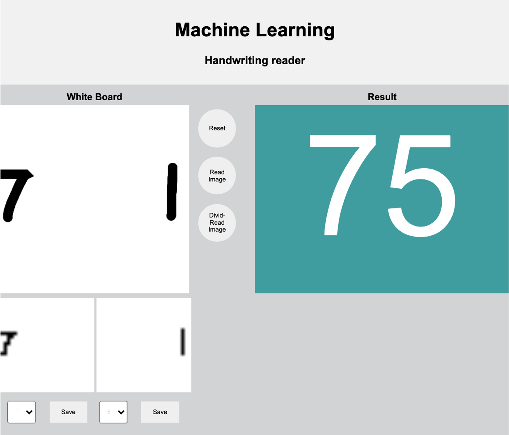

# Handwritting Reader
## Introduction
- Build a canvas using javascipt.
- The app read the numberimage on the canvas using MINST deep learning model.
- If there is two number images, the app divides two images using SVC model, then read the image individually.
- User can save the images and target to MongoDB for future machine learning model training.

## Webpage

## Image data processing 

- In order to use SVC model to separate cluster, we need the position data.
- The numpy array is set of  gray scale of each point
- We use the array index as coordinates
- Now the image become clusters on plot
- Then use SVC model to predict
- Separate the coordinates according to prediction, 0 goes array A, 1 goes array B.
- Resize array to 28x28

<
<

## Deployment
- The app is hosted on Pyhtonanywhere
- The webpage works fine
- But the machine learning functions don't work because the Pythonanywhere web serving framework doesn't allow them to use threads. They don't have soluton for an app to use tensor flow.

## Skills Used
- Python, JavaScript, CSS, Bootstrap
- Flask
- numpy
- Scikit-learn
- Tensorflow
- Base64
- CV2
- Pymongo
- MongoDB, Pymongo
